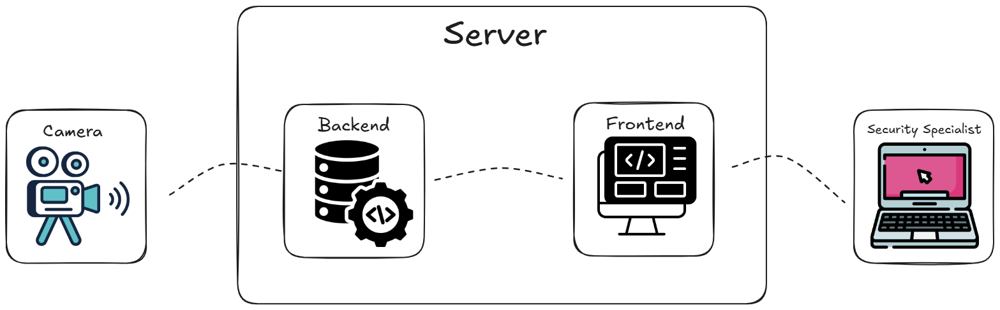
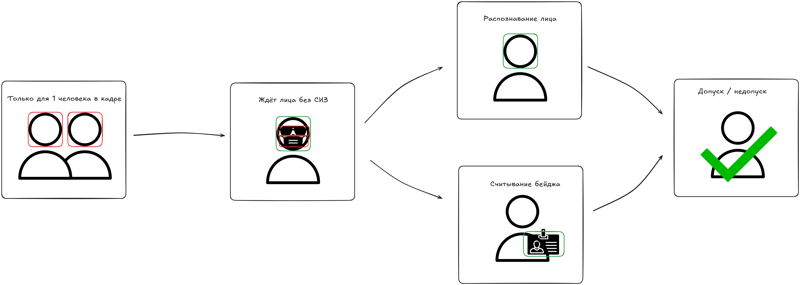
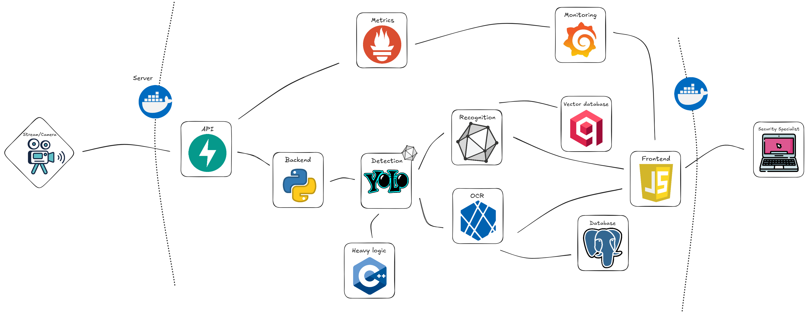

<p align="center">
<a href="#en">English</a> | <a href="#ru">Русский</a>
</p>
<a id="en"></a>
<p align="center">
  
</p>

<h1 align="center">Visor</h1>
<p align="center">
  <a href="https://www.python.org/"></a>
  <a href="https://isocpp.org/"></a>
  <a href="https://fastapi.tiangolo.com/"></a>
  <a href="https://github.com/ultralytics/ultralytics"></a>
  <a href="https://qdrant.tech/"></a>
  <a href="https://opensource.org/licenses/MIT"></a>
</p>

<p align="center">
  <strong>Two-factor employee verification system: real-time face recognition and badge data reading.</strong>
</p>

---

## System Overview

**Visor** focuses on the continuous processing of live video streams from cameras in real time. The system intercepts frames from the stream and simultaneously runs them through a computer vision pipeline: detecting objects, recognizing faces, and reading text from badges without any display delays.

A security officer receives a ready-made interactive dashboard. Instead of raw video, the processed image with model visualization is broadcast there, alongside live verification logs and system metrics.

The main development criterion for Visor is **complete autonomy and privacy**. The system is designed to operate in an isolated network without internet access. No external cloud APIs — absolutely all models are deployed locally and run directly on your server.

<p align="center">
  
</p>

---

## Key Features

- **Real-time processing:** Thanks to Drop Frame technology (smart dropping of outdated frames) and asynchronous model execution, the pipeline delivers a stable 30 FPS with minimal latency.
- **ONNX format models:** Converting all models to the ONNX format completely eliminated heavy dependencies like PyTorch. Inference became faster, and the final image significantly lighter.
- **Containerization:** Full packaging of all modules in Docker. The entire infrastructure is deployed on the server with a single command via Docker Compose.
- **Full locality:** No data is sent to the cloud and no external APIs are used. The system was specifically designed for industrial facilities with unstable internet connections.
- **Monitoring:** Logging of all events and collection of system performance metrics are available, which are immediately sent to Grafana via Prometheus.
- **C++ for heavy operations:** Maximum acceleration of video stream processing by offloading resource-intensive logic and frame preparation to fast C++.

---

## Verification Process

The employee verification process in Visor is divided into clear logical stages. The system doesn't just try to guess a face from the first available frame; it works like a strict state machine:

<p align="center">
  
</p>

### How it works step-by-step:

1. **Queue control (One person in frame):** The system activates only when there is exactly one person in front of the camera. If anyone else enters the frame, the pipeline blocks further steps until order is restored.
2. **Face availability check (No PPE):** Before running heavy recognition, the algorithm checks if the face is uncovered. If the employee hasn't removed sunglasses, a medical mask, or a hard hat blocking the view, the system issues a warning to the operator and waits for a correct frame.
3. **Two-factor check:** Once the perfect frame is caught, the model waits 1.5 seconds to ensure the frame isn't blurred, then launches verification models:
   * **Face recognition:** The face region is cropped, biometric embeddings are generated, and compared against the employee database via a fast vector DB.
   * **Badge reading:** A neural network locates the physical pass on the employee's body, crops it, aligns it, and reads the text data using OCR.
4. **Decision making (Access / Denial):** The backend compares the results: if the face from the database matches the owner of the scanned text badge, the identity is considered confirmed, and the system grants access.

---

## Architecture and Tech Stack

The system is designed as a distributed pipeline, where the main data flow passes through sequential stages of detection, feature extraction, and verification in local databases. 

<p align="center">
  
</p>

### ML Models and Stack Used

The project is based on a combination of high-performance models deployed via **ONNX Runtime**. All inference components support **GPU** operation, ensuring minimal latency when processing video streams:

- **Detection:** `YOLOv26` for real-time detection of faces, badges, and PPE in the frame.
- **Face Recognition:** `InsightFace` (model `buffalo_s`) for generating biometric embeddings.
- **OCR:** `Tesseract` for local text reading from the badge.

### Tech Stack:

- **Backend:** `Python` (`FastAPI`), `C++` for accelerating video frame processing.
- **Image Processing:** `OpenCV` and `NumPy` for efficient video frame processing.
- **Inference Engine:** `ONNX Runtime` (complete abandonment of PyTorch).
- **Storage:** 
  - **Vector DB:** `Qdrant` for fast embedding search.
  - **Database:** `PostgreSQL` for employee data and logging events.
- **DevOps & Infrastructure:** `Docker`, `Docker Compose`, `Prometheus` + `Grafana` (for metrics).
- **Dependency Management:** `uv` to minimize environment build time.

---

## Project Structure

```text
Visor/
├── backend/                  # System core
│   ├── api/                  # FastAPI endpoints
│   ├── core/                 # Essential logic
│   ├── cpp_utils/            # C++ modules
│   ├── database/             # RDBMS and Vector DB interaction logic
│   ├── ml/                   # Scripts for working with models
│   ├── models/               # ONNX model weights
│   ├── services/             # Core business logic
│   └── workers/              # Background workers
├── camera/                   # Video stream capture logic
├── deployment/               # Deployment configurations and scripts
│   ├── volumes/              # Container data
│   ├── .env                  # Environment file
│   └── docker-compose.yml    # Main file for launching all containers
├── frontend/                 # Operator JS interface
├── monitoring/               # Prometheus and Grafana configuration
└── README.md                 # Project documentation
```

### Note on the *camera/* module

This module is intended exclusively for **local development and testing**. It emulates a video stream from your computer's webcam, allowing you to quickly test the pipeline without setting up external cameras.

**When deploying the system on a real facility:**

* The *camera/* module is not used.
* Visor connects directly to RTSP streams from CCTV cameras.
* The video stream source is configured via the *.env* configuration file, allowing flexible switching between any IP cameras.

---

## Quick Start

To run Visor locally or on a server, ensure you have **Docker** and **Docker Compose** installed.

### 1. Cloning the repository

```bash
git clone https://github.com/Wkdk00/Visor.git
cd Visor

```

### 2. Environment setup

Go to the deployment folder and prepare the configuration file:

```bash
cd deployment
cp .env.example .env

```

Open the created `.env` file and ensure it contains the correct paths:

```env
MODEL_DETECTION_PATH = ./models/detection.onnx
MODEL_RECOGNITION_PATH = ./models/recognition.onnx
MODEL_ALIGNMENT_PATH = ./models/aligner.onnx
IDEAL_PATH = ./ideal
PRODUCER_URL = ws://host.docker.internal:8080/ws/video

```

### 3. Launching the infrastructure

```bash
docker-compose up --build

```

*The interface will be available on port 8082.*

---

### Running the camera module (Optional)

If you want to emulate an RTSP stream from your webcam for testing, use the *camera/* module.

*Note: this module runs locally (on the host), not in Docker.*

1. Open a **new terminal**.
2. Go to the module folder:
```bash
cd ../camera

```


3. Create a virtual environment and install dependencies (make sure Python is installed):
```bash
python -m venv venv
source venv/bin/activate  # For Windows: venv\Scripts\activate
pip install -r requirements.txt

```


4. Run the stream:
```bash
python stream.py

```

## License

This project is distributed under the MIT License. See the [LICENSE](LICENSE) file for details.

---


*Author [Wkdk00](https://github.com/Wkdk00) — June 2026*

---
---

<a id="ru"></a>
<p align="center">
  
</p>

<h1 align="center">Visor</h1>
<p align="center">
  <a href="https://www.python.org/"></a>
  <a href="https://isocpp.org/"></a>
  <a href="https://fastapi.tiangolo.com/"></a>
  <a href="https://github.com/ultralytics/ultralytics"></a>
  <a href="https://qdrant.tech/"></a>
  <a href="https://opensource.org/licenses/MIT"></a>
</p>
<p align="center">
  <strong>Система двухэтапной верификации сотрудников: распознавание лиц и считывание данных с бейджей в реальном времени.</strong>
</p>

---

## Обзор системы

**Visor** сфокусирован на непрерывной обработке живого видеопотока с камер в реальном времени. Система перехватывает кадры из стрима и параллельно прогоняет их через конвейер компьютерного зрения: детектирует объекты, распознает лица и считывает текст с бейджей без задержек в отображении.

Сотрудник безопасности получает готовый интерактивный дашборд. Вместо сырого видео туда транслируется обработанная картинка с визуализацией работы моделей, а рядом выводятся живые логи верификации и системные метрики.

Главный критерий разработки Visor — **полная автономность и приватность**. Система спроектирована для работы в изолированном контуре без доступа к интернету. Никаких внешних облачных API — абсолютно все модели развернуты локально и выполняются прямо на вашем сервере.

<p align="center">
  
</p>

---

## Ключевые особенности

- **Real-time обработка:** Благодаря технологии Drop Frame (умный сброс устаревших кадров) и асинхронному запуску моделей, конвейер выдает стабильные 30 FPS с минимальной задержкой.
- **Модели в ONNX-формате:** Перевод всех моделей в формат ONNX позволил полностью избавиться от тяжелых зависимостей вроде PyTorch. Инференс стал быстрее, а финальный образ - значительно легче.
- **Контейнеризация:** Полная упаковка всех модулей в Docker. Вся инфраструктура разворачивается на сервере всего одной командой через Docker Compose.
- **Полная локальность:** Никаких отправок данных в облака и использования API. Система проектировалась специально для работы на промышленных объектах в условиях нестабильного интернета.
- **Мониторинг:** Доступно логирование всех событий и сбор метрик производительности системы, которые сразу улетают в Grafana с помощью Prometheus.
- **C++ для тяжелых операций:** Максимальное ускорение обработки видеопотока за счет выноса ресурсоемкой логики и подготовки кадров на быстрый C++.

---

## Процесс верификации

Процесс верификации сотрудника через Visor разбит на четкие логические этапы. Система не просто пытается угадать лицо по первому попавшемуся кадру, а работает как строгая стейт-машина:

<p align="center">
  
</p>

### Как это устроено по шагам:

1. **Контроль очереди (Один человек в кадре):** Система активируется только тогда, когда перед камерой находится ровно один человек. Если в кадр попадает кто-то еще, конвейер блокирует дальнейшие шаги до наведения порядка.
2. **Проверка доступности лица (Без СИЗ):** Перед запуском тяжелого распознавания алгоритм проверяет, открыто ли лицо. Если сотрудник не снял солнцезащитные очки, медицинскую маску или рабочую каску, перекрывающую обзор, система выдает предупреждение оператору и ждет корректного кадра.
3. **Двухфакторная проверка:** Как только идеальный кадр пойман, модель ждёт 1.5 секунды что бы кадр не был смазанным и запускает модели для верификации:
   * **Распознавание лица:** Вырезается регион лица, строятся биометрические эмбеддинги и сравниваются с базой сотрудников через быструю векторную БД.
   * **Считывание бейджа:** Нейросеть находит на теле сотрудника физический пропуск, вырезает его, выравнивает и считывает текстовые данные с помощью OCR.
4. **Принятие решения (Допуск / Недопуск):** Бэкенд сопоставляет результаты: если лицо из базы данных совпадает с владельцем считанного текстового бейджа, личность считается подтвержденной, система даёт сигнал на допуск.

---

## Архитектура и стек технологий

Система спроектирована как распределенный конвейер, где основной поток данных проходит через последовательные этапы детекции, извлечения признаков и сверки в локальных БД. 

<p align="center">
  
</p>

### Используемые ML-модели и стек

В основе проекта лежит связка высокопроизводительных моделей, развернутых через **ONNX Runtime**. Все компоненты инференса поддерживают работу на **GPU**, что обеспечивает минимальную задержку при обработке видеопотока:

- **Detection:** `YOLOv26` для real-time детекции лиц, бейджей и СИЗ в кадре.
- **Face Recognition:** `InsightFace` (модель `buffalo_s`) для генерации биометрических эмбеддингов.
- **OCR:** `Tesseract` для локального считывания текста с бейджа.

### Технологический стек:

- **Backend:** `Python` (`FastAPI`), `C++` для ускорения обработки видеокадров.
- **Image Processing:** `OpenCV` и `NumPy` для эффективной обработки видеокадров.
- **Inference Engine:** `ONNX Runtime` (полный отказ от PyTorch).
- **Storage:** 
  - **Vector DB:** `Qdrant` для быстрого поиска по эмбендингам.
  - **Database:** `PostgreSQL` данные сотрудников и события логирования.
- **DevOps & Infrastructure:** `Docker`, `Docker Compose`, `Prometheus` + `Grafana` (для метрик).
- **Dependency Management:** `uv` минимизация времени сборки окружения.

---

## Структура проекта

```text
Visor/
├── backend/                  # Ядро системы
│   ├── api/                  # FastAPI эндпоинты
│   ├── core/                 # Необходимая логика
│   ├── cpp_utils/            # C++ модули
│   ├── database/             # Логика взаимодействия с РБД и Векторной БД
│   ├── ml/                   # Скрипты для работы с моделями
│   ├── models/               # ONNX веса моделей
│   ├── services/             # Основная бизнес-логика
│   └── workers/              # Фоновые воркеры
├── camera/                   # Логика захвата видеопотоков
├── deployment/               # Конфигурации и скрипты развертывания
│   ├── volumes/              # Данные контейнеров
│   ├── .env                  # Файл окружения
│   └── docker-compose.yml    # Основной файл запуска всех контейнеров
├── frontend/                 # JS интерфейс оператора
├── monitoring/               # Конфигурация Prometheus и Grafana
└── README.md                 # Документация проекта
```

### Заметка о модуле *camera/*

Этот модуль предназначен исключительно для **локальной разработки и тестирования**. Он эмулирует видеопоток с веб-камеры вашего компьютера, что позволяет быстро проверить работу пайплайна без настройки внешних камер.

**При развертывании системы на реальном объекте:**

* Модуль *camera/* не используется.
* Visor подключается напрямую к RTSP-потокам камер видеонаблюдения.
* Настройка источника видеопотока осуществляется через конфигурационный файл *.env*, что позволяет гибко переключаться между любыми IP-камерами.

---

## Быстрый старт

Для запуска Visor локально или на сервере убедитесь, что у вас установлены **Docker** и **Docker Compose**.

### 1. Клонирование репозитория

```bash
git clone https://github.com/Wkdk00/Visor.git
cd Visor

```

### 2. Настройка окружения

Перейдите в папку развертывания и подготовьте файл конфигурации:

```bash
cd deployment
cp .env.example .env

```

Откройте созданный файл `.env` и убедитесь, что в нем указаны корректные пути:

```env
MODEL_DETECTION_PATH = ./models/detection.onnx
MODEL_RECOGNITION_PATH = ./models/recognition.onnx
MODEL_ALIGNMENT_PATH = ./models/aligner.onnx
IDEAL_PATH = ./ideal
PRODUCER_URL = ws://host.docker.internal:8080/ws/video

```

### 3. Запуск инфраструктуры

```bash
docker-compose up --build

```

*Интерфейс будет доступен на порту 8082.*

---

### Запуск модуля камеры (Опционально)

Если вы хотите эмулировать RTSP-стрим с вашей веб-камеры для тестирования, используйте модуль *camera/*.

*Примечание: этот модуль запускается локально (на хосте), а не в Docker.*

1. Откройте **новый терминал**.
2. Перейдите в папку модуля:
```bash
cd ../camera

```


3. Создайте виртуальное окружение и установите зависимости (убедитесь, что Python установлен):
```bash
python -m venv venv
source venv/bin/activate  # Для Windows: venv\Scripts\activate
pip install -r requirements.txt

```


4. Запустите стрим:
```bash
python stream.py

```

## Лицензия

Этот проект распространяется под лицензией MIT. Подробности см. в файле [LICENSE](LICENSE).

---
---

*Автор [Wkdk00](https://github.com/Wkdk00) — Июнь 2026*
